# Data Model Overview

Documentation is written in English. The application is Danish; all user-facing text lives in Vue I18n locale files.

This document outlines the primary entities and relationships for the event application platform. It serves as a starting point for Drizzle ORM schema definitions and Zod validation.

## Principles
- All primary entities include `id` (UUID), `createdAt`, and `updatedAt`.
- No soft deletion in v1; use status fields instead.
- Audit logging via a dedicated `event_audit_log` table (not exposed in UI in v1).
- GDPR: Minimize personal data. CPR is stored as plain text in v1 (for user identification) and is NOT shown in the admin UI. Revisit encryption in a later version.
- Validation: Enforce user input rules primarily in the frontend; server performs essential verification.

## Mermaid ER Diagram

```mermaid
erDiagram
  USER ||--o{ EVENT_APPLICATION : owns
  EVENT_APPLICATION ||--o{ EVENT_ARTIFACT : has
  EVENT_APPLICATION ||--o{ EVENT_DOCUMENT : has
  EVENT_APPLICATION ||--|| EVENT_SOUND_INFO : has
  EVENT_APPLICATION ||--|| EVENT_WASTE_INFO : has
  EVENT_APPLICATION ||--|| EVENT_FOOD_INFO : has
  EVENT_APPLICATION ||--|| EVENT_SAFETY_INFO : has
  EVENT_APPLICATION ||--|| EVENT_ACCESS_INFO : has
  EVENT_APPLICATION ||--o{ DEPARTMENT_EVENT_STATUS : reviewed_by
  EVENT_APPLICATION ||--o{ EVENT_STATUS_HISTORY : status_changes
  EVENT_APPLICATION ||--o{ EVENT_AUDIT_LOG : audit
  LOCATION_PRESET ||--o{ EVENT_APPLICATION : preselects
  EVENT_APPLICATION }o--o{ EVENT_TYPE_TAG : tagged_via_link

  USER {
    uuid id PK
    text identityType "private|professional"
    text cpr "plain text v1; not shown in admin"
    text mitidUuid
    text name
    text email
    text phone
    text role "user|admin"
    text companyCvr "nullable"
    timestamp lastLoginAt
    text lastIdp
  }

  EVENT_APPLICATION {
    uuid id PK
    uuid ownerUserId FK
    text title
    text purpose
    text expectedAttendanceRange "0_50|51_200|201_500|501_1000|1001_5000|5001_plus"
    boolean commercial
    boolean recurring
    text recurringInterval "daily|weekly|monthly|null"
    timestamp startAt
    timestamp endAt
    timestamp setupStartAt "nullable"
    timestamp setupEndAt "nullable"
    text locationType "predefined|custom"
    text locationAddress "nullable"
    uuid locationPresetId "nullable FK"
    text status "draft|submitted"
    text reviewStatus "unprocessed|in_review|partially_approved|approved|rejected"
    int summaryCompletionPct
    timestamp createdAt
    timestamp updatedAt
  }

  LOCATION_PRESET {
    uuid id PK
    text name
    text slug
    text imageUrl
    text address
    boolean active
  }

  EVENT_TYPE_TAG {
    uuid id PK
    text code "e.g. festival"
    text nameDa
    text nameEn
    boolean active
  }

  EVENT_ARTIFACT {
    uuid id PK
    uuid eventId FK
    text kind "stage|booth|facility|other"
    text label
    int x
    int y
    int width
    int height
    int rotation
  }

  EVENT_DOCUMENT {
    uuid id PK
    uuid eventId FK
    text kind "attachment|construction_certificate|plan|police_approval"
    text fileName
    text mimeType
    int sizeBytes
    bytea content "PDF bytes stored inline"
    timestamp uploadedAt
  }

  EVENT_SOUND_INFO {
    uuid id PK
    uuid eventId FK
    boolean hasSound
    text description "nullable"
    text responsibleName "nullable"
    text responsiblePhone "nullable"
  }

  EVENT_WASTE_INFO {
    uuid id PK
    uuid eventId FK
    boolean needsWasteHandling
    text description "nullable"
  }

  EVENT_FOOD_INFO {
    uuid id PK
    uuid eventId FK
    boolean hasFoodOrBeverage
    text description "nullable"
  }

  EVENT_SAFETY_INFO {
    uuid id PK
    uuid eventId FK
    text simultaneousPersonsRange "same enum as expectedAttendanceRange"
    boolean hasTemporaryConstructions
    text constructionsDescription "nullable"
    uuid constructionsCertificateDocumentId "nullable FK -> EVENT_DOCUMENT.id"
    boolean hasReadBR18Bilag11
    text otherConsiderations "nullable"
  }

  EVENT_ACCESS_INFO {
    uuid id PK
    uuid eventId FK
    boolean needsBlockage
    text blockageDescription "nullable"
    boolean policePermissionApplied
    uuid policeApprovalDocumentId "nullable FK -> EVENT_DOCUMENT.id"
  }

  EVENT_STATUS_HISTORY {
    uuid id PK
    uuid eventId FK
    text fromStatus
    text toStatus
    uuid changedByUserId FK
    timestamp changedAt
    text note "nullable"
  }

  DEPARTMENT_EVENT_STATUS {
    uuid id PK
    uuid eventId FK
    uuid departmentId FK
    text status "pending|in_review|approved"
    text note "nullable"
    timestamp updatedAt
  }

  EVENT_AUDIT_LOG {
    uuid id PK
    uuid eventId FK
    uuid actorUserId FK
    text action "create|update|status_change|add_document|remove_document"
    json payload
    timestamp createdAt
  }
```



## Entities

### User
| Field | Type | Notes |
| ---- | ---- | ----- |
| id | uuid | PK |
| identityType | enum('private','professional') | From MitID |
| cpr | text | Plain text CPR in v1; not exposed in admin UI |
| mitidUuid | text | Unique MitID identifier |
| name | text | Full name |
| email | text | Primary contact |
| phone | text | Phone number |
| role | enum('user','admin') | Application role |
| companyCvr | text nullable | CVR for business users |
| lastLoginAt | timestamp | Last login |
| lastIdp | text | idp (mitid/nemid) |

### Department
| Field | Type | Notes |
| id | uuid | PK |
| name | text | e.g. Byliv og drift |
| slug | text | Unique lowercase |
| active | boolean | Whether department is active |

Seed examples: `byliv-drift`, `klima-miljo`, `byggeri-arkitektur`.

### EventApplication ("Event")
| Field | Type | Notes |
| id | uuid | PK |
| ownerUserId | uuid FK -> User.id | Applicant |
| title | text | Title |
| purpose | text | Purpose |
| expectedAttendanceRange | enum('0_50','51_200','201_500','501_1000','1001_5000','5001_plus') | Selected range |
| commercial | boolean | Commercial? |
| recurring | boolean | Recurring? |
| recurringInterval | enum('daily','weekly','monthly') nullable | If recurring (v1 limited) |
| startAt | timestamp | Start date/time |
| endAt | timestamp | End date/time |
| setupStartAt | timestamp nullable | Setup start |
| setupEndAt | timestamp nullable | Teardown end |
| locationType | enum('predefined','custom') | Custom address or preset |
| locationAddress | text nullable | If custom |
| locationPresetId | uuid nullable | FK -> LocationPreset.id |
| status | enum('draft','submitted') | Submission lifecycle |
| reviewStatus | enum('unprocessed','in_review','partially_approved','approved','rejected') | Global review status |
| summaryCompletionPct | int | 0-100 computed |
| createdAt | timestamp | |
| updatedAt | timestamp | |

### LocationPreset
| Field | Type | Notes |
| id | uuid | PK |
| name | text | Location name |
| slug | text | Unique |
| imageUrl | text | Path to static image |
| address | text | Address |
| active | boolean | |

### EventTypeTag
| Field | Type |
| id | uuid |
| code | text | e.g. 'festival' |
| nameDa | text |
| nameEn | text |
| active | boolean |

Pivot: `event_type_tag_link` (eventId, tagId).

### EventArtifact (map planner element)
Refer to `MAP_GRID_PLANNER.md` for interaction specifics.

| Field | Type | Notes |
| id | uuid | |
| eventId | uuid | FK -> EventApplication.id |
| kind | enum('stage','booth','facility','other') | |
| label | text | |
| x | int | X position |
| y | int | Y position |
| width | int | Width |
| height | int | Height |
| rotation | int | Degrees |

### EventDocument
| Field | Type | Notes |
| id | uuid | |
| eventId | uuid | FK -> EventApplication.id |
| kind | enum('attachment','construction_certificate','plan','police_approval') | |
| fileName | text | |
| mimeType | text | |
| sizeBytes | int | |
| content | bytea | PDF bytes stored inline in the same row |
| uploadedAt | timestamp | |

### EventSoundInfo
| Field | Type | Notes |
| id | uuid | |
| eventId | uuid | FK -> EventApplication.id |
| hasSound | boolean | |
| description | text nullable | |
| responsibleName | text nullable | |
| responsiblePhone | text nullable | |

### EventWasteInfo
| Field | Type | Notes |
| id | uuid | |
| eventId | uuid | FK -> EventApplication.id |
| needsWasteHandling | boolean | |
| description | text nullable | |

### EventFoodInfo
| Field | Type | Notes |
| id | uuid | |
| eventId | uuid | FK -> EventApplication.id |
| hasFoodOrBeverage | boolean | |
| description | text nullable | |

### EventSafetyInfo
| Field | Type | Notes |
| id | uuid | |
| eventId | uuid | FK -> EventApplication.id |
| simultaneousPersonsRange | enum like expectedAttendanceRange | |
| hasTemporaryConstructions | boolean | |
| constructionsDescription | text nullable | |
| constructionsCertificateDocumentId | uuid nullable | FK -> EventDocument.id |
| hasReadBR18Bilag11 | boolean | |
| otherConsiderations | text nullable | |

### EventAccessInfo (blockage & permits)
| Field | Type | Notes |
| id | uuid | |
| eventId | uuid | FK -> EventApplication.id |
| needsBlockage | boolean | |
| blockageDescription | text nullable | |
| policePermissionApplied | boolean | |
| policeApprovalDocumentId | uuid nullable | FK -> EventDocument.id |

### EventStatusHistory
| Field | Type | Notes |
| id | uuid | |
| eventId | uuid | FK -> EventApplication.id |
| fromStatus | enum | |
| toStatus | enum | |
| changedByUserId | uuid | FK -> User.id |
| changedAt | timestamp | |
| note | text nullable | |

### DepartmentEventStatus
| Field | Type | Notes |
| id | uuid | |
| eventId | uuid | FK -> EventApplication.id |
| departmentId | uuid | FK -> Department.id |
| status | enum('pending','in_review','approved') | |
| note | text nullable | |
| updatedAt | timestamp | |

### EventAuditLog
| Field | Type | Notes |
| id | uuid | |
| eventId | uuid | FK -> EventApplication.id |
| actorUserId | uuid | FK -> User.id |
| action | enum('create','update','status_change','add_document','remove_document') | |
| payload | json | |
| createdAt | timestamp | |

## Relationships
- User 1:N EventApplication
- EventApplication 1:N EventArtifact
- EventApplication 1:N EventDocument
- EventApplication 1:1 EventSoundInfo (optional)
- EventApplication 1:1 EventWasteInfo (optional)
- EventApplication 1:1 EventFoodInfo (optional)
- EventApplication 1:1 EventSafetyInfo (optional)
- EventApplication 1:1 EventAccessInfo (optional)
- EventApplication N:M EventTypeTag via event_type_tag_link
- EventApplication 1:N DepartmentEventStatus (one per department)
- EventApplication 1:N EventStatusHistory
- EventApplication 1:N EventAuditLog
- LocationPreset 1:N EventApplication (predefined location)

## Indexing Strategy
- event_application: index (ownerUserId, status), (startAt), (locationPresetId)
- department_event_status: unique(eventId, departmentId)
- event_status_history: index(eventId)
- event_audit_log: index(eventId), (actorUserId)
- event_artifact: index(eventId)
- event_document: index(eventId, kind)

## Validation (Zod)
Example create schema:
```ts
const EventApplicationSchema = z.object({
  title: z.string().min(3),
  purpose: z.string().min(10),
  expectedAttendanceRange: z.enum(['0_50','51_200','201_500','501_1000','1001_5000','5001_plus']),
  commercial: z.boolean(),
  recurring: z.boolean(),
  recurringInterval: z.enum(['daily','weekly','monthly']).optional().nullable(),
  startAt: z.coerce.date(),
  endAt: z.coerce.date(),
  setupStartAt: z.coerce.date().optional().nullable(),
  setupEndAt: z.coerce.date().optional().nullable(),
  location: z.discriminatedUnion('locationType', [
    z.object({ locationType: z.literal('custom'), address: z.string().min(5) }),
    z.object({ locationType: z.literal('predefined'), presetId: z.string().uuid() }),
  ]),
  typeTagCodes: z.array(z.string().min(2)).nonempty(),
})
```

## Future Extensions
- Payment / fees module
- Notifications / email queue
- Add versioning in a later version (not v1)
- GeoJSON for precise locations instead of static grid

## Open Questions
- Artifact fields: add `zIndex` and `color`?
- Server-side file size limits (currently frontend only)?
- When to introduce CPR encryption (v2 plan)?

Feedback welcome before schema implementation.
