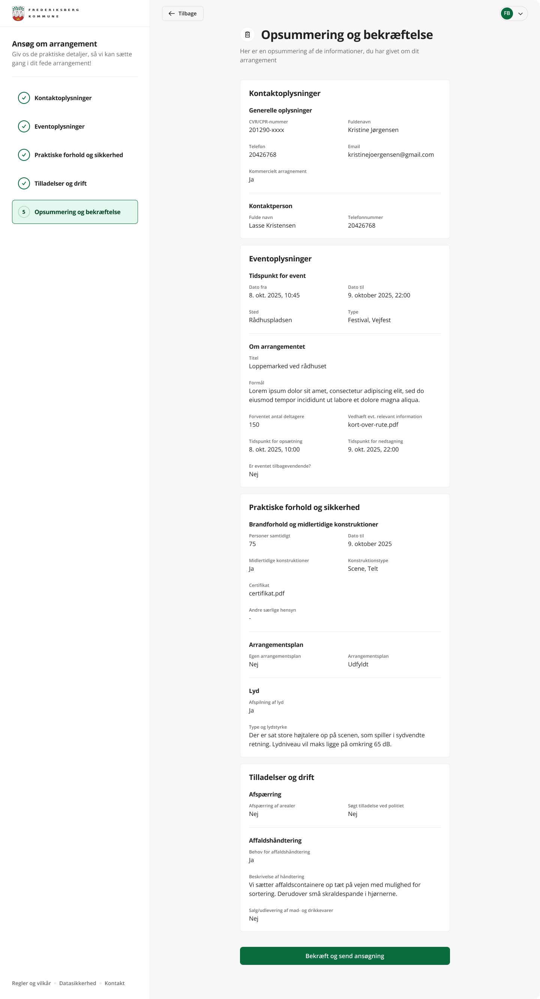

# Visual References

Central index of UI and flow imagery for quick lookup and for AI retrieval context. Use these relative paths when referencing assets.

## Conventions
- Filenames use Danish where user‑facing (e.g. `bekræftelse`).
- Status variants: `tom` (empty), `udfyldt` (filled), `fejl` (error).
- Admin context under `admin/`; citizen flow under `flow/`; onboarding/start under `start/`.
- SVGs are illustrative icons; PNGs are full screenshots.

## Admin Screens
- Overblik: `../Images/admin/overblik.png`
- Detaljeside – overblik: `../Images/admin/detaljeside.png`
- Detaljeside – godkend ansøgning modal: `../Images/admin/detaljeside/godkend-ansøgning.png`

## Citizen Flow – Step Screens
### Eventoplysninger
- Tom: `../Images/flow/eventoplysninger/tom.png`
- Udfyldt: `../Images/flow/eventoplysninger/udfyldt.png`

### Kontaktoplysninger
- Skærm: `../Images/flow/kontaktoplysninger.png`
- Fejl state: `../Images/flow/kontaktoplysninger/fejl.png`

### Praktiske forhold og sikkerhed
- Tom: `../Images/flow/praktiske-forhold-og-sikkerhed/tom.png`
- Udfyldt: `../Images/flow/praktiske-forhold-og-sikkerhed/udfyldt.png`
- Fejl: `../Images/flow/praktiske-forhold-og-sikkerhed/fejl.png`
- Info banner: `../Images/flow/praktiske-forhold-og-sikkerhed/Info banner.png`
- Ikon – byggeplads: `../Images/flow/praktiske-forhold-og-sikkerhed/Construction Site 1.svg`
- Ikon – våbenskjold: `../Images/flow/praktiske-forhold-og-sikkerhed/Coat of Arms.png`

### Tilladelser og drift
- Tom: `../Images/flow/tilladelser-og-drift/tom.png`
- Udfyldt: `../Images/flow/tilladelser-og-drift/udfyldt.png`

### Opsummering og bekræftelse
- Skærm: `../Images/flow/opsummering-og-bekræftelse.png`
- Fejl: `../Images/flow/opsummering-og-bekræftelse/fejl.png`
- Endelig bekræftelse: `../Images/flow/bekræftelse.png`

### Øvrige Flow Ikoner
- Coat of Arms Lockup: `../Images/flow/Coat of Arms Lockup - Right.svg`
- Money Jar (økonomi): `../Images/flow/Money Jar-2 1.svg`

## Start / Onboarding
- Tidligere ansøgninger: `../Images/start/tidligere-ansøgninger.png`

## Artifact
- Design artefakt v2: `../Images/artefakt-v2 1.png`

## Usage
Reference with Markdown:
```md

```

When adding new images:
1. Place under the closest existing folder; create a new subfolder only if a new step/domain.
2. Use lowercase, hyphen‑separated Danish names; spaces allowed only if matching existing naming pattern.
3. Update this index in the matching section.

## AI Retrieval Notes
- This list improves embedding recall; chunk this file separately per section.
- Do not inline base64 of images; keep path references only.
